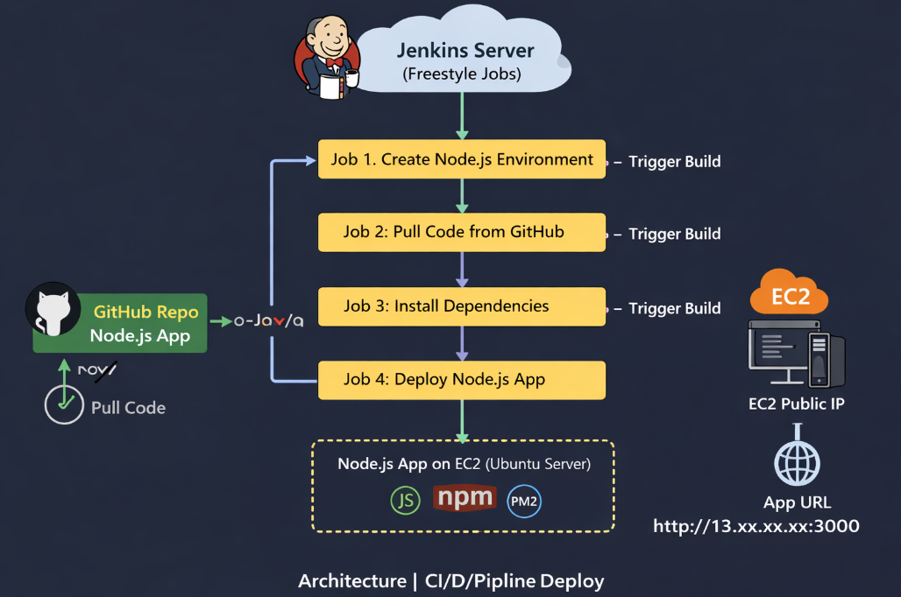
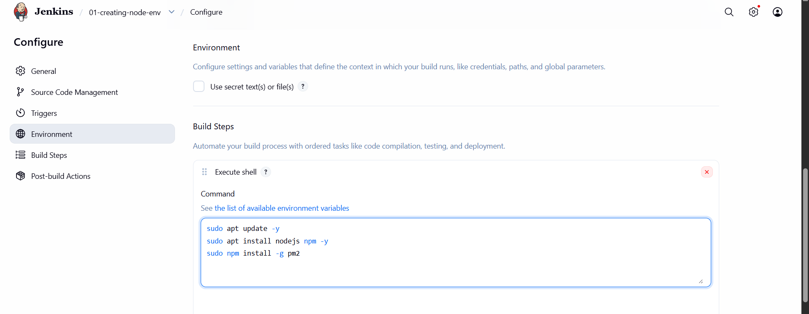
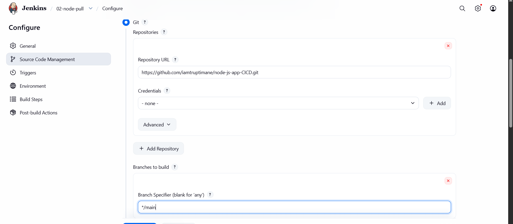
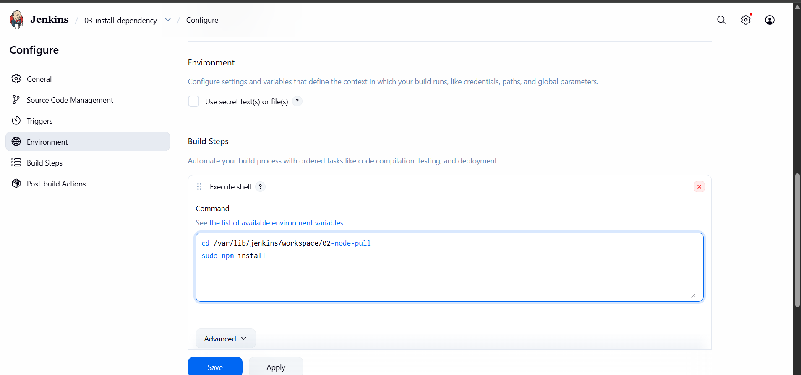
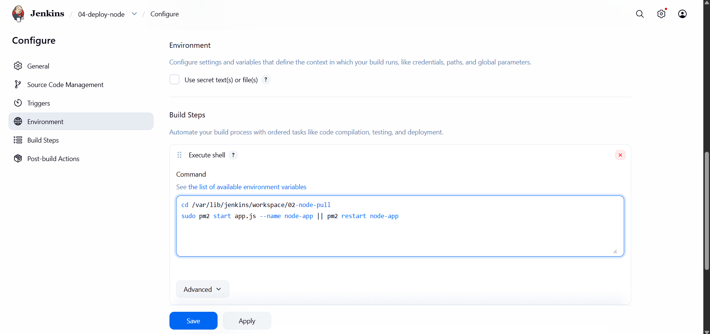

# Node.js Application Deployment using Jenkins (Freestyle CI/CD)

## ➤  Project Overview
This project demonstrates how to build a **CI/CD pipeline using Jenkins Freestyle jobs** to deploy a Node.js application.

The pipeline automates:
- Environment setup
- Code pull from GitHub
- Dependency installation
- Application deployment using PM2

---

## ➤  Architecture Diagram


---

## ➤  Architecture / Workflow
```
01-create-node-env
↓
02-node-pull-repo
↓
03-node-install-deps
↓
04-node-deploy-app
```

---

## ➤  Tools & Technologies Used

- Jenkins (Freestyle Jobs)
- Node.js
- npm
- PM2 (Process Manager)
- Git & GitHub
- Linux (Ubuntu / EC2)


---

## ➤ Jenkins Job Setup

###  Job 1: Create Environment

**Job Name:** `01-create-node-env`

**Purpose:**  
Install required tools for Node.js deployment.

**Build Steps:**
```bash
sudo apt update
sudo apt install -y nodejs
sudo apt install -y npm
sudo npm install -g pm2
```



**Post-Build Action:**
➡️ Trigger: 02-node-pull-repo

###  Job 2: Pull Repository

**Job Name:** `02-node-pull-repo`

**Description:**  
Pulls the Node.js application code from GitHub.

**Steps:**
1. Go to Jenkins Dashboard → Click **New Item**  
2. Select **Freestyle Project**  
3. Enter name: `02-node-pull-repo`  
4. Click **OK**  

**Source Code Management:**
- Select **Git**
- Repository URL: node app git url
- Branch: main


**Build Steps:**  
(No build step required — this job only pulls the code)

**Post-Build Action:**
- Build other projects: `03-node-install-deps`




###  Job 3: Install Dependencies

**Job Name:** `03-node-install-deps`

**Description:**  
Installs the required Node.js dependencies using npm.

**Steps:**
1. Go to Jenkins Dashboard → Click **New Item**  
2. Select **Freestyle Project**  
3. Enter name: `03-node-install-deps`  
4. Click **OK**  

**Build Steps → Execute Shell:**
```bash
cd /var/lib/jenkins/workspace/02-node-pull-repo
npm install
```
**Post-Build Action:**
- Build other projects: 04-node-deploy-app




###  Job 4: Deploy Application

**Job Name:** `04-node-deploy-app`

**Description:**  
Deploys the Node.js application using PM2. It starts the app if not running, otherwise restarts it.

**Steps:**
1. Go to Jenkins Dashboard → Click **New Item**  
2. Select **Freestyle Project**  
3. Enter name: `04-node-deploy-app`  
4. Click **OK**  

**Build Steps → Execute Shell:**
```bash
cd /var/lib/jenkins/workspace/02-node-pull-repo

pm2 start app.js --name node-app || pm2 restart node-app
```




## ➤ Access Application
Once deployed, access your app using:
```
http://<EC2-PUBLIC-IP>:<APP-PORT>
```


## ➤ Learning Outcome
- Understood CI/CD pipeline basics
- Learned Jenkins job chaining
- Deployed Node.js app using PM2
- Gained hands-on DevOps experience

